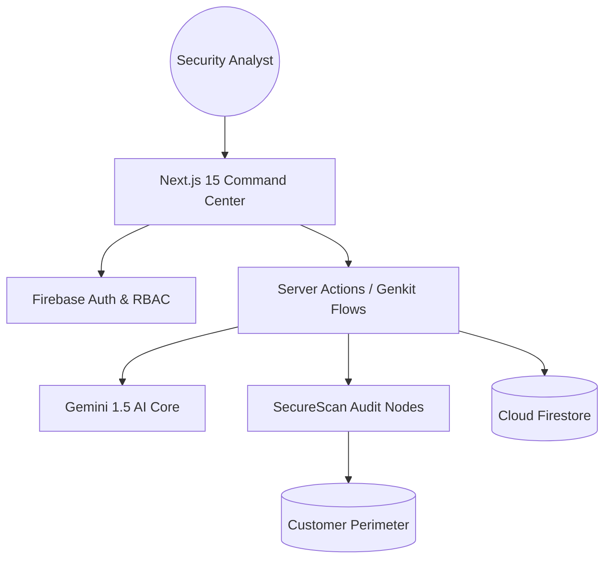

# 🛡️ SecureScan – Enterprise AI-Powered Vulnerability Command Center

[](https://nextjs.org/)
[](https://firebase.google.com/)
[](https://firebase.google.com/docs/genkit)
[](https://tailwindcss.com/)

SecureScan is an elite, full-stack cybersecurity platform designed for high-compliance engineering teams. It provides a centralized command center for authorized asset discovery, multi-engine vulnerability auditing, and Gemini-powered remediation intelligence.

---

## 🚀 Key Features

### 📡 Tactical Asset Management
*   **Authorized Inventory**: Track Websites, Domains, IP Addresses, and Servers with explicit verification.
*   **Dynamic Categorization**: Tag and group assets by environment (Production, Staging, Dev).
*   **Health Monitoring**: Real-time status tracking (Healthy, Vulnerable, Scanning).

### 🔍 Multi-Engine Auditing
*   **Orchestrated Scans**: Parallel execution of industry-standard tools:
    *   **Nuclei**: Fast, template-based CVE discovery.
    *   **OWASP ZAP**: Dynamic application security testing (DAST).
    *   **Vuls**: Agent-less vulnerability assessment for Linux/Docker.
    *   **Nmap**: Advanced port discovery and service fingerprinting.
*   **Live Telemetry**: Real-time terminal output during engine execution.

### 🧠 Gemini AI Security Analyst
*   **Deep Vulnerability Analysis**: Technical deep-dives into CVEs and CVSS vectors.
*   **NIST-Aligned Remediation**: Step-by-step IR plans and secure coding recommendations.
*   **Threat Hunting**: AI-generated SIEM queries (KQL, Splunk) for active hunting.
*   **Executive Summarization**: Strategic briefs tailored for C-suite stakeholders.

### 📊 Strategic Dashboards & Reporting
*   **Security Health Index**: A-F grading based on real-time risk exposure.
*   **GRC Alignment**: Automatic mapping of findings to OWASP Top 10 and MITRE ATT&CK.
*   **Enterprise Reports**: Professional PDF/JSON/CSV export with AI-synthesized summaries.

---

## 🏗 Technology Stack

*   **Frontend**: Next.js 15 (App Router), React 19, TypeScript, Tailwind CSS.
*   **Motion**: Framer Motion for high-fidelity animations.
*   **UI Components**: ShadCN UI + custom glassmorphic theme.
*   **Backend**: Firebase (Firestore, Authentication, Storage).
*   **AI Engine**: Google Genkit + Gemini 2.5 Flash.
*   **Reporting**: jsPDF & jsPDF-AutoTable.

---

## 📐 System Architecture



---

## 📂 Folder Structure

```text
src/
├── ai/                 # Genkit AI Flows & Configuration
├── app/                # Next.js App Router (Dashboard, Landing, Auth)
├── components/         # ShadCN & Dashboard UI Components
├── firebase/           # Client SDK Hooks & Specialized Error Handling
├── hooks/              # Custom React Hooks
├── lib/                # Utilities, Audit Loggers, & Data Mappings
└── services/           # Backend Data Services
docs/
├── API.md              # Internal API Documentation
└── SRS.md              # Software Requirements Specification
```

---

## 🛠 Installation & Setup

### 1. Clone the Repository
```bash
git clone https://github.com/your-org/securescan.git
cd securescan
```

### 2. Configure Environment Variables
Create a `.env.local` file with the following keys:
```env
NEXT_PUBLIC_FIREBASE_API_KEY=your_key
NEXT_PUBLIC_FIREBASE_AUTH_DOMAIN=your_project.firebaseapp.com
NEXT_PUBLIC_FIREBASE_PROJECT_ID=your_project
GEMINI_API_KEY=your_google_ai_key
```

### 3. Initialize & Run
```bash
npm install
npm run dev
```

---

## 📖 Usage Guide

1.  **Authorization**: Login via the secure entrance.
2.  **Asset Registry**: Add your authorized targets (URLs/IPs) in the **Asset Inventory**.
3.  **Initiate Audit**: Select a target in the **Scan Engine**, confirm ethical consent, and launch an engine (e.g., Nuclei CVE Scan).
4.  **Analyze Findings**: Review technical evidence in the **Vulnerability Hub**.
5.  **AI Consult**: Use the **Security Ops AI** to generate a remediation roadmap.
6.  **Report**: Compile and download a professional PDF audit in the **Compliance Hub**.

---

## 🚢 Deployment

SecureScan is optimized for **Firebase App Hosting**. 

1.  Connect your GitHub repository to Firebase.
2.  Configure the build settings for Next.js 15.
3.  Add environment variables in the Firebase Console.
4.  Deploy to Global Edge.

---

## 🔮 Future Enhancements

- [ ] **Cloud Connector**: Native integration with AWS/Azure/GCP for automated asset discovery.
- [ ] **Webhook Alerts**: Real-time critical alerts to Slack, Teams, and PagerDuty.
- [ ] **MFA Hardening**: Full FIDO2/WebAuthn support for analyst workstations.
- [ ] **SIEM Sync**: Direct streaming of telemetry to Splunk and Microsoft Sentinel.

---

## 📜 License

© 2024 SecureScan Technologies Corp. Built for Defensive Security. Proprietary license for authorized organizational use.

## 👤 Author

**App Prototyper AI**
*Firebase Studio – Premium Enterprise Edition*