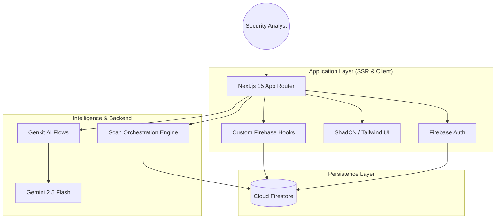
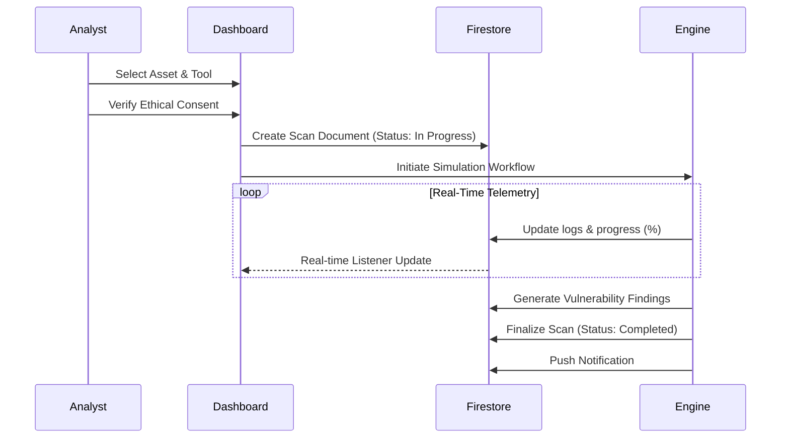
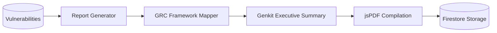

# 🏗️ SecureScan Technical Architecture

This document outlines the system architecture of the SecureScan platform. SecureScan is built using a modern, serverless, event-driven architecture designed for high availability, real-time telemetry, and AI-driven intelligence.

---

## 1. High-Level System Overview

SecureScan utilizes a hybrid cloud architecture leveraging **Next.js 15** for the core application logic and **Firebase** for persistence and identity.

---

## 2. Core Modules

### 2.1 Authentication & RBAC
- **Identity Provider**: Firebase Authentication (Google & Email/Password).
- **Entitlements**: Role-Based Access Control (RBAC) enforced via Firestore Security Rules.
- **Roles**: `Admin`, `Analyst`, `Viewer`.

### 2.2 Scan Orchestration Engine
The Scanning Engine is an asynchronous, state-managed pipeline that simulates industry-standard tool behavior while maintaining ethical consent boundaries.

### 2.3 AI Intelligence Module
Powered by **Google Genkit**, the AI module handles complex technical tasks:
- **Vulnerability Explanation**: Deep dive into technical mechanics.
- **Remediation Planning**: Generating NIST-aligned IR plans.
- **Threat Hunting**: Synthesizing SIEM queries (KQL/Splunk).
- **Executive Summarization**: Tailoring technical data for C-suite stakeholders.

### 2.4 Persistence (Firestore)
The database is structured for real-time reactivity:
- `/users/{uid}`: Profile and settings.
- `/assets/{id}`: Scoped security targets.
- `/scans/{id}`: Job execution and logs.
- `/vulnerabilities/{id}`: Normalized findings.
- `/auditLogs/{id}`: Immutable platform operations history.

---

## 3. Data Flow: Reporting Hub

---

## 4. Deployment Architecture

SecureScan is optimized for **Firebase App Hosting**, providing native support for Next.js SSR and localized edge deployment.

- **Frontend**: Next.js 15 (Turbopack optimized).
- **Edge Runtime**: SSR components executed on Google Cloud Run.
- **Secrets Management**: Google Cloud Secret Manager integration for `FIREBASE_API_KEY` and `GEMINI_API_KEY`.
- **CI/CD**: Automatic rollouts via GitHub integration.

---

© 2024 SecureScan Technologies Corp. Built for Defensive Excellence.
