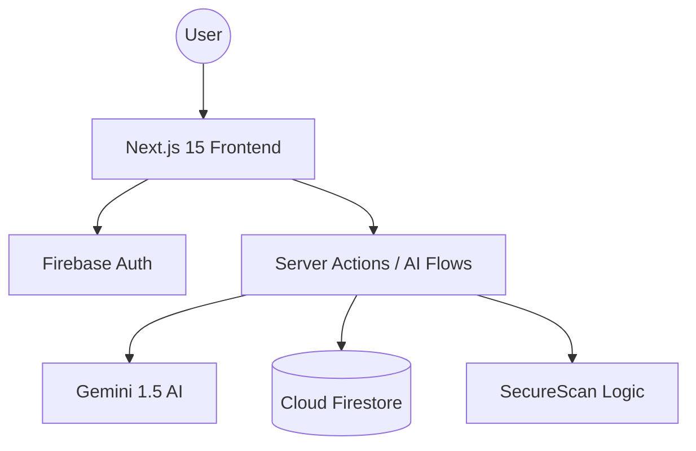
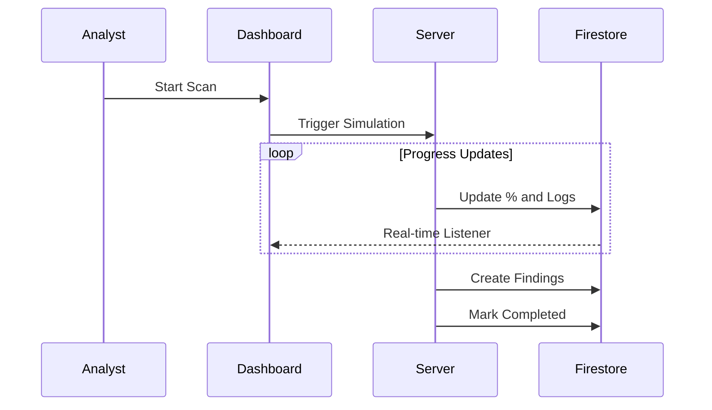

# Software Requirements Specification (SRS)
## SecureScan – Cyber Security Vulnerability Scanner & Security Dashboard

**Version:** 1.0  
**Status:** Final  
**Date:** March 2024

---

### 1. Cover Page
**Project Name:** SecureScan  
**Project Type:** Enterprise Cyber Security SaaS  
**Document Type:** Software Requirements Specification (SRS)  
**Authors:** App Prototyper AI  
**Organization:** Firebase Studio

---

### 2. Table of Contents
1. Introduction
2. Overall Description
3. Functional Requirements
4. Non-Functional Requirements
5. System Architecture
6. Database Design
7. Use Case Analysis
8. System Workflows
9. API Design
10. Security Requirements
11. DevOps & Deployment
12. Testing Strategy
13. Project Management
14. Conclusion

---

### 3. Introduction

#### 3.1 Purpose
The purpose of this document is to provide a detailed overview of the SecureScan project. It outlines the technical architecture, functional capabilities, and security standards for a production-ready vulnerability assessment platform.

#### 3.2 Scope
SecureScan is a web-based SaaS platform designed for security analysts and CISOs. It provides automated asset discovery, vulnerability scanning, AI-powered remediation advice, and executive reporting.

#### 3.3 Definitions & Acronyms
- **CVE:** Common Vulnerabilities and Exposures
- **CVSS:** Common Vulnerability Scoring System
- **CSP:** Content Security Policy
- **RBAC:** Role-Based Access Control
- **OWASP:** Open Web Application Security Project

#### 3.4 References
- IEEE Standard 830-1998 for SRS.
- OWASP Top 10 Documentation (2021).
- Firebase Security Best Practices.

---

### 4. Overall Description

#### 4.1 Product Perspective
SecureScan operates as a standalone security monitoring layer that interacts with client-defined assets (Websites, Servers, IPs). It utilizes Firebase for real-time data persistence and Google Gemini for AI analysis.

#### 4.2 Product Functions
- **Asset Discovery:** Identifying and categorizing digital property.
- **Vulnerability Assessment:** Automated scanning for known security flaws.
- **AI Remediation:** Generating code-level fixes using LLMs.
- **Compliance Reporting:** Exporting findings in PDF/CSV/JSON.
- **Audit Trails:** Tracking all administrative actions.

#### 4.3 User Classes
1. **Security Analyst:** Performs scans and remediates findings.
2. **Administrator:** Manages users, roles, and global configurations.
3. **CISO:** Reviews high-level dashboards and executive reports.

---

### 5. Functional Requirements

| ID | Requirement | Description |
|---|---|---|
| FR-01 | User Auth | Secure Google & Email/Password authentication. |
| FR-02 | Asset CRUD | Users can manage their security perimeter. |
| FR-03 | Scan Engine | Execution of Nmap/ZAP-style automated scans. |
| FR-04 | Live Updates | Real-time scan progress via Firestore listeners. |
| FR-05 | AI Assistant | Chat-based analysis of vulnerabilities. |
| FR-06 | Report Gen | On-demand generation of compliance documents. |
| FR-07 | Audit Logs | Logging of all sensitive operations. |

---

### 6. Non-Functional Requirements

- **Performance:** Scans must handle 100+ concurrent assets.
- **Security:** 256-bit encryption for data at rest (Firestore default).
- **Availability:** 99.9% uptime target.
- **Usability:** WCAG 2.1 compliant UI.

---

### 7. System Architecture

#### 7.1 High-Level Architecture

#### 7.2 Low-Level Architecture
The system utilizes a serverless architecture where Next.js Server Actions act as the controller layer. The "Backend" is essentially the Firebase Admin SDK interacting with Firestore.

---

### 8. Database Design

#### 8.1 Schema Overview
- **Users:** Profile data and RBAC roles.
- **Assets:** Target URL/IP, environment, and ownership.
- **Scans:** Status, logs, and progress.
- **Vulnerabilities:** Severity, CVE, CVSS, and remediation content.
- **AuditLogs:** Immutable history of actions.

---

### 9. Use Cases

#### 9.1 Use Case: Launch Scan
1. Analyst selects an Asset.
2. Analyst chooses Scan Type (Full/Port/SSL).
3. System initiates background process.
4. UI displays real-time progress.
5. Findings are written to Vulnerabilities collection.

---

### 10. System Workflows

#### 10.1 Scan Workflow

---

### 11. REST API Design (Internal)
- `POST /api/scans`: Triggers a new assessment.
- `GET /api/vulnerabilities`: Returns findings with filters.
- `POST /api/ai/analyze`: Feeds vuln data to Gemini.
- `GET /api/reports`: Fetches generated audit docs.

---

### 12. Security Requirements
- **JWT:** Handled via Firebase ID Tokens.
- **RBAC:** Enforced via Firestore Security Rules and Server Action validation.
- **Input Validation:** Zod schemas for all form and API inputs.
- **XSS/CSRF:** Native Next.js protections.

---

### 13. DevOps & Deployment

#### 13.1 Deployment Architecture
- **Hosting:** Firebase App Hosting (SSR Support).
- **CI/CD:** GitHub Actions for automated linting, building, and deployment.
- **Environment:** Production/Staging parity.

---

### 14. Testing Strategy
- **Unit Testing:** Jest for utility functions (Risk scoring).
- **Integration Testing:** React Testing Library for UI components.
- **E2E Testing:** Playwright for critical paths (Login to Scan).

---

### 15. Project Timeline (8 Weeks)
- **Week 1-2:** Foundation & Auth.
- **Week 3-4:** Asset & Scan Engine development.
- **Week 5:** AI Integration (Gemini Flows).
- **Week 6:** Reporting & Compliance mappings.
- **Week 7:** Admin Panel & Audit Logging.
- **Week 8:** Security hardening and final QA.

---

### 16. Conclusion
SecureScan provides a modern, scalable, and AI-driven approach to vulnerability management. By leveraging the Google Cloud / Firebase ecosystem, it ensures high availability and enterprise-grade security for critical digital assets.
